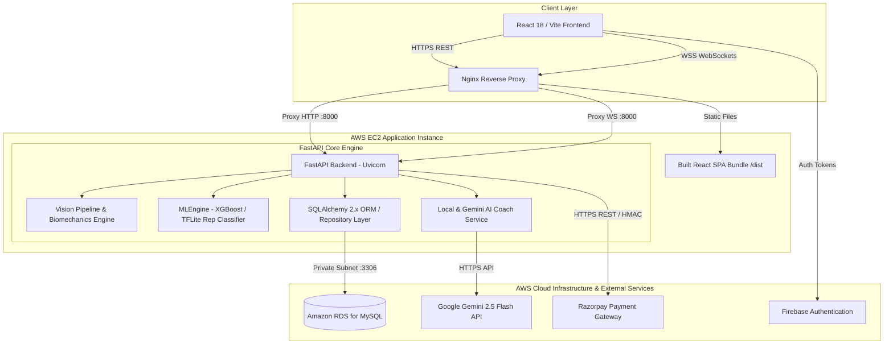
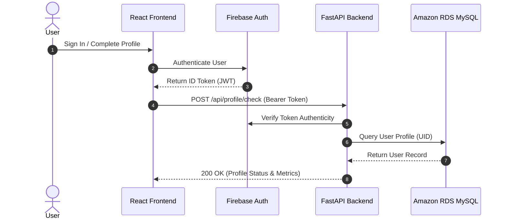
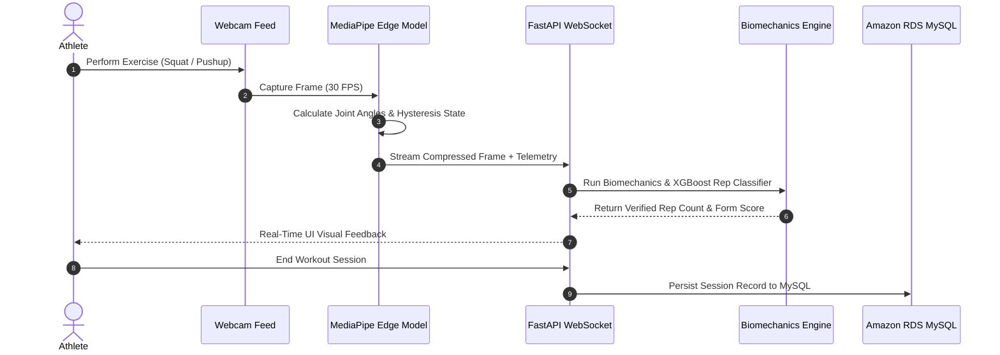
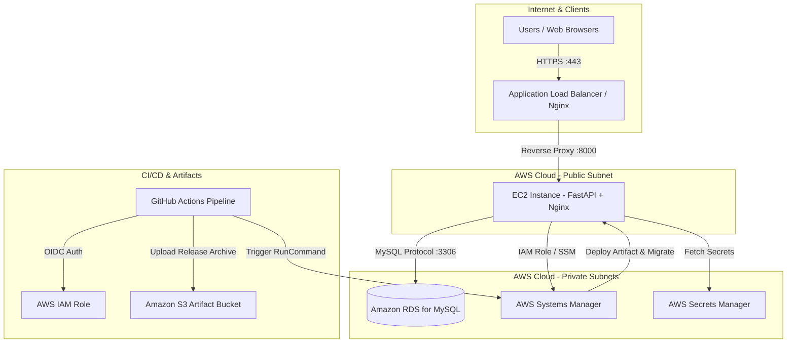

# Burn-Ex — System Architecture & Technical Specification

## Executive Summary

Burn-Ex is an AI-powered biomechanics and metabolic expenditure inference SaaS platform. It combines real-time computer vision pose tracking, client-side MediaPipe/TensorFlow.js edge AI models, server-side FastAPI biomechanics analytics, Google Gemini LLM coaching, and Amazon RDS MySQL data persistence.

---

## 1. System Architecture Diagram

---

## 2. Component Details

### 2.1 Frontend Architecture (React 18 + Vite)
- **Single Page Application (SPA)**: Built with React 18, Vite, and TailwindCSS in a clean light-mode aesthetic.
- **Client-Side Vision Processing**: Implements `aiModelService.js` (TensorFlow.js + MediaPipe Pose) for zero-latency camera frame analysis, joint angle calculation, ROM (Range of Motion) scoring, and rep hysteresis state machine.
- **Real-Time Telemetry Stream**: `useWsWorkout.js` streams compressed video frames over WebSockets (`/ws/live-workout`) to the backend for server-side biomechanical verification.

### 2.2 Backend Architecture (FastAPI + SQLAlchemy 2.x)
- **API Server (`backend/api.py`)**: Asynchronous FastAPI server exposing RESTful endpoints for profile management, workouts, notifications, subscription status, AI Coach queries, and Razorpay order creation.
- **Resilient Engine Lifecycle (`backend/db/database.py`)**: Synchronous SQLAlchemy 2.x connection pool with dynamic health checks, auto-reconnection logic, and zero-downtime startup fallbacks.
- **Database Repository (`backend/db/mysql_repository.py`)**: Encapsulates 100% of application persistence using SQLAlchemy ORM models (`User`, `WorkoutSession`, `AIPlan`, `Notification`, `Leaderboard`, `Payment`, `Subscription`).

### 2.3 External Integrations
- **Firebase Authentication**: Validates user identity and verifies Firebase Bearer ID tokens on protected API endpoints via `AuthService.js` and `get_current_user` dependency.
- **Google Gemini AI API**: Generates personalized circuit plans, nutrition recommendations, and interactive AI Coach responses (`gemini-2.5-flash`).
- **Razorpay Payments**: Handles monthly SaaS subscription orders (`₹499/month`), HMAC SHA256 cryptographic signature verification, and webhook notifications.

---

## 3. Data Flow Architecture

### 3.1 Authentication & Profile Check Flow

### 3.2 Live Workout Hysteresis & Biomechanics Flow

---

## 4. Target Production AWS Architecture

---

## 5. Security & Compliance Controls

1. **Private Database Subnets**: Amazon RDS for MySQL is deployed strictly in private VPC subnets with no public IP address and security group ingress restricted to port 3306 from the EC2 application security group.
2. **Keyless CI/CD via OIDC**: GitHub Actions authenticates to AWS using short-lived OpenID Connect (OIDC) tokens (`aws-actions/configure-aws-credentials`), eliminating long-lived AWS IAM access keys.
3. **Secret Isolation**: Production database credentials, Razorpay secret keys, and Gemini API keys are retrieved securely from AWS Secrets Manager or EC2 environment variables — never exposed to client-side bundles or source code.
4. **Cryptographic Signature Verification**: Razorpay payment verification uses HMAC SHA256 signature comparison (`hmac.compare_digest`) on the server before granting Pro entitlements.
